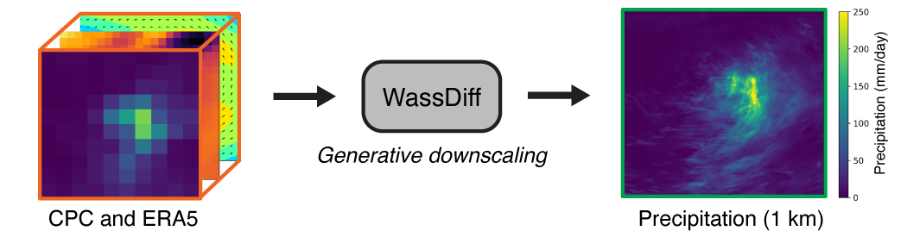

<div align="center">

# Downscaling Extreme Precipitation with Wasserstein Regularized Diffusion
<a href="https://pytorch.org/get-started/locally/"></a>
<a href="https://pytorchlightning.ai/"></a>
<a href="https://hydra.cc/"></a>
<a href="https://github.com/ashleve/lightning-hydra-template"></a><br>
[](https://arxiv.org/abs/2410.00381)
[-4b44ce.svg)](https://ieeexplore.ieee.org/document/11172297)
[](https://colab.research.google.com/drive/1A07CzPGE1imSnkaQtU34fNIVIYMRXIWV?usp=sharing)
[](https://huggingface.co/YuhaoL/WassDiff/tree/main)
</div>

This is the official implementation of the paper 
[_Downscaling Extreme Precipitation with Wasserstein Regularized Diffusion_](https://ieeexplore.ieee.org/document/11172297). 
To quickly experiment with the proposed diffusion downscaling model (called WassDiff), 
we recommend trying this Colab [demo](https://colab.research.google.com/drive/1A07CzPGE1imSnkaQtU34fNIVIYMRXIWV?usp=sharing).

<div align="center">
  
</div>

## Dependencies
To create a conda environment with all the required packages, run:
```
conda env create -f environment.yml
```

## Dataset Compilation
We present two options to obtain the dataset required for this project. 

### _Option A_: mini dataset
If you would like to quickly test-run the pre-trained model, please download a mini-dataset on 
[Hugging Face](https://huggingface.co/YuhaoL/WassDiff/tree/main/mini_dataset), 
which contains all required historical inputs from 1990 – 2000 on CONUS.
Keep in mind that there are no ground-truth radar measurements for this time period -- supervised training is not possible.

### _Option B_: full dataset
If you would like to train the model from scratch, 
then here are the instructions on how to obtain the required training and validation data: 

**CPC Unified Gauge-Based Analysis of Daily Precipitation**: navigate to [NOAA](https://psl.noaa.gov/data/gridded/data.cpc.globalprecip.html), download `.nc` under precipitation.
Choose appropriate years.
The gauge density files are stored separately on NOAA's FTP server [here](https://ftp.cpc.ncep.noaa.gov/precip/CPC_UNI_PRCP/).
Download `.gz` files from [here](https://ftp.cpc.ncep.noaa.gov/precip/CPC_UNI_PRCP/GAUGE_CONUS/RT/).

**ERA5 and MRMS**: download instructions can be found on this [repository](https://github.com/dossgollin-lab/climate-data).

### Setup dataset configs

Once all the data is downloaded, navigate to `configs/local/default.yaml` and update these entries according to 
where the data are stored on your local machine: 

```yaml
# @package _global_
# This file is not tracked by git and is specific to YOUR MACHINE
# note: do not append / at the end of the path
local:
  data_dir: # PATH TO ROOT DATA
  log_dir: # PATH TO WANDB LOG
  eval_set_root_dir: # PATH TO EVAL OUTPUT
  specified_eval_root_dir: # PATH TO MATPLOTLIB OUTPUT
  model_root_dir: # PATH TO MODEL WEIGHTS
```

## Training
To train the proposed model (WassDiff), run
```python
python src/train.py trainer=gpu model=wassdiff experiment=det_val_sampler
```

To train the baseline diffusion model (SBDM, to be trained without Wasserstein Distance Regularization), run
```python
python src/train.py trainer=gpu model=ablation_wdr experiment=det_val_sampler
```

## Evaluation
### Obtain metrics on full test set

Download model weights from [HuggingFace](https://huggingface.co/YuhaoL/WassDiff/blob/main/wassdiff.pth). 
Quantitative evaluation can be done by running 
```python
python ./src/eval.py trainer=gpu model=wassdiff experiment=eval_val_set ckpt_path=PATH_TO_MODEL_WEIGHTS name=NAME_OF_DIRECTORY
```

Set `ckpt_path` to the path of the model weights you want to evaluate, and name to the name of the directory 
where the evaluation results will be stored.
Note that the evaluation results will be stored in `eval_set_root_dir` specified in `configs/local/default.yaml`.

### Downscale any targets

Alternatively, to generate sample(s) (single or ensemble) on a specified region and date (requires input data to be downloaded), run

```python
python ./src/eval.py model=wassdiff experiment=specified_eval
 ckpt_path=PATH_TO_MODEL_WEIGHTS name=NAME_OF_DIRECTORY
```

Set `ckpt_path` to the path of the model weights you want to evaluate, and name to the name of the directory 
where the evaluation results will be stored.
Note that the evaluation results will be stored in `specified_eval_root_dir` specified in `configs/local/default.yaml`.

To adjust ensemble size, append `model.num_samples=ENSEMBLE_SIZE` to the command above.
You may modify the `lon`, `lat`, and `date` parameters in `configs/experiment/specified_eval.yaml` 
to specify the region and date of interest.

### Continental-scale generation
You can optionally use `tiled_diffusion` to generate larger images (such as for the entire CONUS region).
To do so, use `model=wassdiff_tiled` in the command below:
```python
python ./src/eval.py model=wassdiff experiment=specified_eval model=wassdiff_tiled ckpt_path=PATH_TO_MODEL_WEIGHTS name=NAME_OF_DIRECTORY
```

